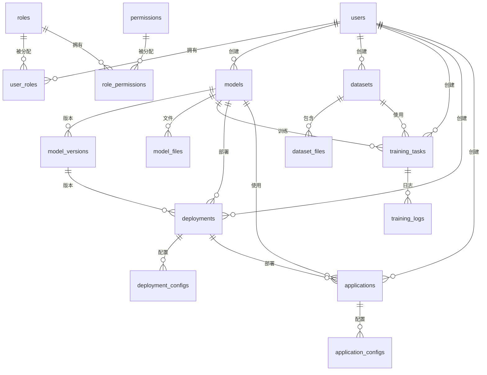

# AI Cockpit 数据库设计文档

> 基于 MySQL 8.0 的数据库架构设计

## 📊 数据库概览

AI Cockpit 平台采用关系型数据库 MySQL 8.0，设计遵循第三范式，支持高性能查询和数据一致性。

### 数据库信息
- **数据库名称**: `ai_cockpit`
- **字符集**: `utf8mb4`
- **排序规则**: `utf8mb4_unicode_ci`
- **引擎**: `InnoDB`

### 表结构总览

| 模块 | 表数量 | 主要表 |
|------|--------|--------|
| 用户管理 | 4 | users, roles, permissions, user_roles |
| 模型管理 | 3 | models, model_versions, model_files |
| 数据集管理 | 2 | datasets, dataset_files |
| 训练管理 | 2 | training_tasks, training_logs |
| 部署管理 | 2 | deployments, deployment_configs |
| 应用管理 | 2 | applications, application_configs |
| 系统监控 | 1 | system_monitor |

## 👥 用户管理模块

### users 用户表

**表说明**: 存储系统用户信息

| 字段名 | 类型 | 长度 | 是否主键 | 是否为空 | 默认值 | 说明 |
|--------|------|------|----------|----------|--------|------|
| id | bigint | 20 | 是 | 否 | AUTO_INCREMENT | 用户ID |
| username | varchar | 50 | 否 | 否 | | 用户名 |
| password | varchar | 100 | 否 | 否 | | 密码（BCrypt加密） |
| email | varchar | 100 | 否 | 是 | NULL | 邮箱 |
| nickname | varchar | 50 | 否 | 是 | NULL | 昵称 |
| avatar | varchar | 200 | 否 | 是 | NULL | 头像URL |
| phone | varchar | 20 | 否 | 是 | NULL | 手机号 |
| status | tinyint | 1 | 否 | 否 | 1 | 状态（0-禁用，1-启用） |
| last_login_time | datetime | | 否 | 是 | NULL | 最后登录时间 |
| create_time | datetime | | 否 | 否 | CURRENT_TIMESTAMP | 创建时间 |
| update_time | datetime | | 否 | 否 | CURRENT_TIMESTAMP ON UPDATE CURRENT_TIMESTAMP | 更新时间 |

**索引**:
- 主键: `PRIMARY KEY (id)`
- 唯一索引: `UNIQUE KEY uk_username (username)`
- 普通索引: `KEY idx_email (email)`, `KEY idx_status (status)`

**SQL示例**:
```sql
CREATE TABLE users (
    id BIGINT AUTO_INCREMENT PRIMARY KEY,
    username VARCHAR(50) NOT NULL UNIQUE,
    password VARCHAR(100) NOT NULL,
    email VARCHAR(100),
    nickname VARCHAR(50),
    avatar VARCHAR(200),
    phone VARCHAR(20),
    status TINYINT DEFAULT 1 NOT NULL,
    last_login_time DATETIME,
    create_time DATETIME DEFAULT CURRENT_TIMESTAMP NOT NULL,
    update_time DATETIME DEFAULT CURRENT_TIMESTAMP ON UPDATE CURRENT_TIMESTAMP NOT NULL,
    INDEX idx_email (email),
    INDEX idx_status (status)
) ENGINE=InnoDB DEFAULT CHARSET=utf8mb4 COLLATE=utf8mb4_unicode_ci;
```

### roles 角色表

**表说明**: 存储系统角色信息

| 字段名 | 类型 | 长度 | 是否主键 | 是否为空 | 默认值 | 说明 |
|--------|------|------|----------|----------|--------|------|
| id | bigint | 20 | 是 | 否 | AUTO_INCREMENT | 角色ID |
| name | varchar | 50 | 否 | 否 | | 角色名称 |
| code | varchar | 50 | 否 | 否 | | 角色代码 |
| description | varchar | 200 | 否 | 是 | NULL | 角色描述 |
| status | tinyint | 1 | 否 | 否 | 1 | 状态（0-禁用，1-启用） |
| create_time | datetime | | 否 | 否 | CURRENT_TIMESTAMP | 创建时间 |
| update_time | datetime | | 否 | 否 | CURRENT_TIMESTAMP ON UPDATE CURRENT_TIMESTAMP | 更新时间 |

**索引**:
- 主键: `PRIMARY KEY (id)`
- 唯一索引: `UNIQUE KEY uk_code (code)`

### permissions 权限表

**表说明**: 存储系统权限信息

| 字段名 | 类型 | 长度 | 是否主键 | 是否为空 | 默认值 | 说明 |
|--------|------|------|----------|----------|--------|------|
| id | bigint | 20 | 是 | 否 | AUTO_INCREMENT | 权限ID |
| name | varchar | 50 | 否 | 否 | | 权限名称 |
| code | varchar | 100 | 否 | 否 | | 权限代码 |
| resource | varchar | 100 | 否 | 是 | NULL | 资源类型 |
| action | varchar | 50 | 否 | 是 | NULL | 操作类型 |
| description | varchar | 200 | 否 | 是 | NULL | 权限描述 |
| parent_id | bigint | 20 | 否 | 是 | NULL | 父权限ID |
| sort | int | 11 | 否 | 否 | 0 | 排序 |
| create_time | datetime | | 否 | 否 | CURRENT_TIMESTAMP | 创建时间 |

**索引**:
- 主键: `PRIMARY KEY (id)`
- 唯一索引: `UNIQUE KEY uk_code (code)`
- 外键: `FOREIGN KEY (parent_id) REFERENCES permissions(id)`

### user_roles 用户角色关联表

**表说明**: 用户和角色的多对多关联表

| 字段名 | 类型 | 长度 | 是否主键 | 是否为空 | 默认值 | 说明 |
|--------|------|------|----------|----------|--------|------|
| id | bigint | 20 | 是 | 否 | AUTO_INCREMENT | 关联ID |
| user_id | bigint | 20 | 否 | 否 | | 用户ID |
| role_id | bigint | 20 | 否 | 否 | | 角色ID |
| create_time | datetime | | 否 | 否 | CURRENT_TIMESTAMP | 创建时间 |

**索引**:
- 主键: `PRIMARY KEY (id)`
- 唯一索引: `UNIQUE KEY uk_user_role (user_id, role_id)`
- 外键: 
  - `FOREIGN KEY (user_id) REFERENCES users(id)`
  - `FOREIGN KEY (role_id) REFERENCES roles(id)`

## 🤖 模型管理模块

### models 模型表

**表说明**: 存储AI模型基本信息

| 字段名 | 类型 | 长度 | 是否主键 | 是否为空 | 默认值 | 说明 |
|--------|------|------|----------|----------|--------|------|
| id | bigint | 20 | 是 | 否 | AUTO_INCREMENT | 模型ID |
| name | varchar | 100 | 否 | 否 | | 模型名称 |
| version | varchar | 20 | 否 | 否 | | 模型版本 |
| model_type | varchar | 50 | 否 | 否 | | 模型类型 |
| framework | varchar | 50 | 否 | 否 | | 框架类型 |
| description | text | | 否 | 是 | NULL | 模型描述 |
| status | tinyint | 1 | 否 | 否 | 0 | 状态（0-未训练，1-训练中，2-训练完成，3-部署中，4-已部署） |
| accuracy | decimal | 5,4 | 否 | 是 | NULL | 准确率 |
| loss | decimal | 8,6 | 否 | 是 | NULL | 损失值 |
| file_size | bigint | 20 | 否 | 是 | NULL | 文件大小（字节） |
| created_by | bigint | 20 | 否 | 否 | | 创建人ID |
| create_time | datetime | | 否 | 否 | CURRENT_TIMESTAMP | 创建时间 |
| update_time | datetime | | 否 | 否 | CURRENT_TIMESTAMP ON UPDATE CURRENT_TIMESTAMP | 更新时间 |

**索引**:
- 主键: `PRIMARY KEY (id)`
- 普通索引: `KEY idx_model_type (model_type)`, `KEY idx_status (status)`, `KEY idx_created_by (created_by)`
- 外键: `FOREIGN KEY (created_by) REFERENCES users(id)`

### model_versions 模型版本表

**表说明**: 存储模型版本历史信息

| 字段名 | 类型 | 长度 | 是否主键 | 是否为空 | 默认值 | 说明 |
|--------|------|------|----------|----------|--------|------|
| id | bigint | 20 | 是 | 否 | AUTO_INCREMENT | 版本ID |
| model_id | bigint | 20 | 否 | 否 | | 模型ID |
| version | varchar | 20 | 否 | 否 | | 版本号 |
| file_path | varchar | 500 | 否 | 是 | NULL | 模型文件路径 |
| accuracy | decimal | 5,4 | 否 | 是 | NULL | 准确率 |
| loss | decimal | 8,6 | 否 | 是 | NULL | 损失值 |
| training_time | int | 11 | 否 | 是 | NULL | 训练时长（秒） |
| parameters | text | | 否 | 是 | NULL | 训练参数（JSON格式） |
| create_time | datetime | | 否 | 否 | CURRENT_TIMESTAMP | 创建时间 |

**索引**:
- 主键: `PRIMARY KEY (id)`
- 唯一索引: `UNIQUE KEY uk_model_version (model_id, version)`
- 外键: `FOREIGN KEY (model_id) REFERENCES models(id)`

### model_files 模型文件表

**表说明**: 存储模型相关文件信息

| 字段名 | 类型 | 长度 | 是否主键 | 是否为空 | 默认值 | 说明 |
|--------|------|------|----------|----------|--------|------|
| id | bigint | 20 | 是 | 否 | AUTO_INCREMENT | 文件ID |
| model_id | bigint | 20 | 否 | 否 | | 模型ID |
| file_name | varchar | 200 | 否 | 否 | | 文件名 |
| file_path | varchar | 500 | 否 | 否 | | 文件路径 |
| file_type | varchar | 50 | 否 | 否 | | 文件类型 |
| file_size | bigint | 20 | 否 | 否 | | 文件大小 |
| md5 | varchar | 32 | 否 | 是 | NULL | 文件MD5 |
| create_time | datetime | | 否 | 否 | CURRENT_TIMESTAMP | 创建时间 |

**索引**:
- 主键: `PRIMARY KEY (id)`
- 普通索引: `KEY idx_model_id (model_id)`, `KEY idx_file_type (file_type)`
- 外键: `FOREIGN KEY (model_id) REFERENCES models(id)`

## 📊 数据集管理模块

### datasets 数据集表

**表说明**: 存储数据集基本信息

| 字段名 | 类型 | 长度 | 是否主键 | 是否为空 | 默认值 | 说明 |
|--------|------|------|----------|----------|--------|------|
| id | bigint | 20 | 是 | 否 | AUTO_INCREMENT | 数据集ID |
| name | varchar | 100 | 否 | 否 | | 数据集名称 |
| data_type | varchar | 50 | 否 | 否 | | 数据类型 |
| description | text | | 否 | 是 | NULL | 数据集描述 |
| file_count | int | 11 | 否 | 否 | 0 | 文件数量 |
| total_size | bigint | 20 | 否 | 否 | 0 | 总大小（字节） |
| status | tinyint | 1 | 否 | 否 | 0 | 状态（0-未处理，1-处理中，2-处理完成） |
| created_by | bigint | 20 | 否 | 否 | | 创建人ID |
| create_time | datetime | | 否 | 否 | CURRENT_TIMESTAMP | 创建时间 |
| update_time | datetime | | 否 | 否 | CURRENT_TIMESTAMP ON UPDATE CURRENT_TIMESTAMP | 更新时间 |

**索引**:
- 主键: `PRIMARY KEY (id)`
- 普通索引: `KEY idx_data_type (data_type)`, `KEY idx_status (status)`, `KEY idx_created_by (created_by)`
- 外键: `FOREIGN KEY (created_by) REFERENCES users(id)`

### dataset_files 数据集文件表

**表说明**: 存储数据集文件详细信息

| 字段名 | 类型 | 长度 | 是否主键 | 是否为空 | 默认值 | 说明 |
|--------|------|------|----------|----------|--------|------|
| id | bigint | 20 | 是 | 否 | AUTO_INCREMENT | 文件ID |
| dataset_id | bigint | 20 | 否 | 否 | | 数据集ID |
| file_name | varchar | 200 | 否 | 否 | | 文件名 |
| file_path | varchar | 500 | 否 | 否 | | 文件路径 |
| file_type | varchar | 50 | 否 | 否 | | 文件类型 |
| file_size | bigint | 20 | 否 | 否 | | 文件大小 |
| md5 | varchar | 32 | 否 | 是 | NULL | 文件MD5 |
| labels | text | | 否 | 是 | NULL | 标签信息（JSON格式） |
| create_time | datetime | | 否 | 否 | CURRENT_TIMESTAMP | 创建时间 |

**索引**:
- 主键: `PRIMARY KEY (id)`
- 普通索引: `KEY idx_dataset_id (dataset_id)`, `KEY idx_file_type (file_type)`
- 外键: `FOREIGN KEY (dataset_id) REFERENCES datasets(id)`

## 🚀 训练管理模块

### training_tasks 训练任务表

**表说明**: 存储模型训练任务信息

| 字段名 | 类型 | 长度 | 是否主键 | 是否为空 | 默认值 | 说明 |
|--------|------|------|----------|----------|--------|------|
| id | bigint | 20 | 是 | 否 | AUTO_INCREMENT | 任务ID |
| task_name | varchar | 100 | 否 | 否 | | 任务名称 |
| model_id | bigint | 20 | 否 | 否 | | 模型ID |
| dataset_id | bigint | 20 | 否 | 否 | | 数据集ID |
| status | tinyint | 1 | 否 | 否 | 0 | 状态（0-等待中，1-运行中，2-完成，3-失败，4-取消） |
| progress | decimal | 5,2 | 否 | 否 | 0.00 | 进度百分比 |
| parameters | text | | 否 | 是 | NULL | 训练参数（JSON格式） |
| start_time | datetime | | 否 | 是 | NULL | 开始时间 |
| end_time | datetime | | 否 | 是 | NULL | 结束时间 |
| total_time | int | 11 | 否 | 是 | NULL | 总时长（秒） |
| created_by | bigint | 20 | 否 | 否 | | 创建人ID |
| create_time | datetime | | 否 | 否 | CURRENT_TIMESTAMP | 创建时间 |
| update_time | datetime | | 否 | 否 | CURRENT_TIMESTAMP ON UPDATE CURRENT_TIMESTAMP | 更新时间 |

**索引**:
- 主键: `PRIMARY KEY (id)`
- 普通索引: `KEY idx_model_id (model_id)`, `KEY idx_dataset_id (dataset_id)`, `KEY idx_status (status)`, `KEY idx_created_by (created_by)`
- 外键: 
  - `FOREIGN KEY (model_id) REFERENCES models(id)`
  - `FOREIGN KEY (dataset_id) REFERENCES datasets(id)`
  - `FOREIGN KEY (created_by) REFERENCES users(id)`

### training_logs 训练日志表

**表说明**: 存储训练过程中的详细日志

| 字段名 | 类型 | 长度 | 是否主键 | 是否为空 | 默认值 | 说明 |
|--------|------|------|----------|----------|--------|------|
| id | bigint | 20 | 是 | 否 | AUTO_INCREMENT | 日志ID |
| task_id | bigint | 20 | 否 | 否 | | 任务ID |
| epoch | int | 11 | 否 | 否 | | 训练轮次 |
| loss | decimal | 8,6 | 否 | 否 | | 损失值 |
| accuracy | decimal | 5,4 | 否 | 是 | NULL | 准确率 |
| learning_rate | decimal | 10,8 | 否 | 是 | NULL | 学习率 |
| log_time | datetime | | 否 | 否 | CURRENT_TIMESTAMP | 日志时间 |

**索引**:
- 主键: `PRIMARY KEY (id)`
- 普通索引: `KEY idx_task_id (task_id)`, `KEY idx_epoch (epoch)`
- 外键: `FOREIGN KEY (task_id) REFERENCES training_tasks(id)`

## 🎯 部署管理模块

### deployments 部署表

**表说明**: 存储模型部署信息

| 字段名 | 类型 | 长度 | 是否主键 | 是否为空 | 默认值 | 说明 |
|--------|------|------|----------|----------|--------|------|
| id | bigint | 20 | 是 | 否 | AUTO_INCREMENT | 部署ID |
| name | varchar | 100 | 否 | 否 | | 部署名称 |
| model_id | bigint | 20 | 否 | 否 | | 模型ID |
| version_id | bigint | 20 | 否 | 否 | | 版本ID |
| endpoint | varchar | 200 | 否 | 是 | NULL | 服务端点 |
| status | tinyint | 1 | 否 | 否 | 0 | 状态（0-未部署，1-部署中，2-运行中，3-停止，4-异常） |
| replicas | int | 11 | 否 | 否 | 1 | 副本数量 |
| cpu_limit | varchar | 20 | 否 | 是 | NULL | CPU限制 |
| memory_limit | varchar | 20 | 否 | 是 | NULL | 内存限制 |
| created_by | bigint | 20 | 否 | 否 | | 创建人ID |
| create_time | datetime | | 否 | 否 | CURRENT_TIMESTAMP | 创建时间 |
| update_time | datetime | | 否 | 否 | CURRENT_TIMESTAMP ON UPDATE CURRENT_TIMESTAMP | 更新时间 |

**索引**:
- 主键: `PRIMARY KEY (id)`
- 普通索引: `KEY idx_model_id (model_id)`, `KEY idx_status (status)`, `KEY idx_created_by (created_by)`
- 外键: 
  - `FOREIGN KEY (model_id) REFERENCES models(id)`
  - `FOREIGN KEY (version_id) REFERENCES model_versions(id)`
  - `FOREIGN KEY (created_by) REFERENCES users(id)`

### deployment_configs 部署配置表

**表说明**: 存储部署配置信息

| 字段名 | 类型 | 长度 | 是否主键 | 是否为空 | 默认值 | 说明 |
|--------|------|------|----------|----------|--------|------|
| id | bigint | 20 | 是 | 否 | AUTO_INCREMENT | 配置ID |
| deployment_id | bigint | 20 | 否 | 否 | | 部署ID |
| config_key | varchar | 100 | 否 | 否 | | 配置键 |
| config_value | text | | 否 | 是 | NULL | 配置值 |
| config_type | varchar | 50 | 否 | 否 | | 配置类型 |
| description | varchar | 200 | 否 | 是 | NULL | 配置描述 |
| create_time | datetime | | 否 | 否 | CURRENT_TIMESTAMP | 创建时间 |

**索引**:
- 主键: `PRIMARY KEY (id)`
- 唯一索引: `UNIQUE KEY uk_deployment_key (deployment_id, config_key)`
- 外键: `FOREIGN KEY (deployment_id) REFERENCES deployments(id)`

## 🎭 应用管理模块

### applications 应用表

**表说明**: 存储AI应用信息

| 字段名 | 类型 | 长度 | 是否主键 | 是否为空 | 默认值 | 说明 |
|--------|------|------|----------|----------|--------|------|
| id | bigint | 20 | 是 | 否 | AUTO_INCREMENT | 应用ID |
| name | varchar | 100 | 否 | 否 | | 应用名称 |
| app_type | varchar | 50 | 否 | 否 | | 应用类型 |
| description | text | | 否 | 是 | NULL | 应用描述 |
| model_id | bigint | 20 | 否 | 是 | NULL | 关联模型ID |
| deployment_id | bigint | 20 | 否 | 是 | NULL | 关联部署ID |
| status | tinyint | 1 | 否 | 否 | 0 | 状态（0-未部署，1-部署中，2-运行中，3-停止） |
| access_url | varchar | 200 | 否 | 是 | NULL | 访问地址 |
| created_by | bigint | 20 | 否 | 否 | | 创建人ID |
| create_time | datetime | | 否 | 否 | CURRENT_TIMESTAMP | 创建时间 |
| update_time | datetime | | 否 | 否 | CURRENT_TIMESTAMP ON UPDATE CURRENT_TIMESTAMP | 更新时间 |

**索引**:
- 主键: `PRIMARY KEY (id)`
- 普通索引: `KEY idx_app_type (app_type)`, `KEY idx_status (status)`, `KEY idx_created_by (created_by)`
- 外键: 
  - `FOREIGN KEY (model_id) REFERENCES models(id)`
  - `FOREIGN KEY (deployment_id) REFERENCES deployments(id)`
  - `FOREIGN KEY (created_by) REFERENCES users(id)`

### application_configs 应用配置表

**表说明**: 存储应用配置信息

| 字段名 | 类型 | 长度 | 是否主键 | 是否为空 | 默认值 | 说明 |
|--------|------|------|----------|----------|--------|------|
| id | bigint | 20 | 是 | 否 | AUTO_INCREMENT | 配置ID |
| application_id | bigint | 20 | 否 | 否 | | 应用ID |
| config_key | varchar | 100 | 否 | 否 | | 配置键 |
| config_value | text | | 否 | 是 | NULL | 配置值 |
| config_type | varchar | 50 | 否 | 否 | | 配置类型 |
| description | varchar | 200 | 否 | 是 | NULL | 配置描述 |
| create_time | datetime | | 否 | 否 | CURRENT_TIMESTAMP | 创建时间 |

**索引**:
- 主键: `PRIMARY KEY (id)`
- 唯一索引: `UNIQUE KEY uk_app_key (application_id, config_key)`
- 外键: `FOREIGN KEY (application_id) REFERENCES applications(id)`

## 📈 系统监控模块

### system_monitor 系统监控表

**表说明**: 存储系统监控数据

| 字段名 | 类型 | 长度 | 是否主键 | 是否为空 | 默认值 | 说明 |
|--------|------|------|----------|----------|--------|------|
| id | bigint | 20 | 是 | 否 | AUTO_INCREMENT | 监控ID |
| cpu_usage | decimal | 5,2 | 否 | 否 | | CPU使用率 |
| memory_usage | decimal | 5,2 | 否 | 否 | | 内存使用率 |
| disk_usage | decimal | 5,2 | 否 | 否 | | 磁盘使用率 |
| network_in | bigint | 20 | 否 | 否 | | 网络流入量 |
| network_out | bigint | 20 | 否 | 否 | | 网络流出量 |
| active_users | int | 11 | 否 | 否 | | 活跃用户数 |
| api_requests | int | 11 | 否 | 否 | | API请求数 |
| error_count | int | 11 | 否 | 否 | | 错误数量 |
| monitor_time | datetime | | 否 | 否 | CURRENT_TIMESTAMP | 监控时间 |

**索引**:
- 主键: `PRIMARY KEY (id)`
- 普通索引: `KEY idx_monitor_time (monitor_time)`

## 🔗 表关系图



## 📋 数据字典

### 状态枚举值

**用户状态**:
- `0`: 禁用
- `1`: 启用

**模型状态**:
- `0`: 未训练
- `1`: 训练中
- `2`: 训练完成
- `3`: 部署中
- `4`: 已部署

**训练任务状态**:
- `0`: 等待中
- `1`: 运行中
- `2`: 完成
- `3`: 失败
- `4`: 取消

**部署状态**:
- `0`: 未部署
- `1`: 部署中
- `2`: 运行中
- `3`: 停止
- `4`: 异常

### 模型类型枚举

- `TEXT_CLASSIFICATION`: 文本分类
- `IMAGE_CLASSIFICATION`: 图像分类
- `OBJECT_DETECTION`: 目标检测
- `SPEECH_RECOGNITION`: 语音识别
- `NATURAL_LANGUAGE_PROCESSING`: 自然语言处理

### 应用类型枚举

- `CHATBOT`: 聊天机器人
- `IMAGE_RECOGNITION`: 图像识别
- `VOICE_ASSISTANT`: 语音助手
- `DATA_ANALYSIS`: 数据分析
- `PREDICTION_MODEL`: 预测模型

## 🔧 数据库优化建议

### 索引优化

1. **高频查询字段**: 为经常用于查询条件的字段建立索引
2. **联合索引**: 对于多条件查询，建立联合索引
3. **前缀索引**: 对于较长的字符串字段，使用前缀索引

### 分区策略

对于大数据量表（如监控数据、日志数据），建议按时间分区：

```sql
-- 按月分区示例
PARTITION BY RANGE (YEAR(monitor_time) * 100 + MONTH(monitor_time)) (
    PARTITION p202401 VALUES LESS THAN (202402),
    PARTITION p202402 VALUES LESS THAN (202403),
    PARTITION p202403 VALUES LESS THAN (202404)
)
```

### 备份策略

1. **全量备份**: 每周一次全量备份
2. **增量备份**: 每天增量备份
3. **日志备份**: 实时binlog备份

## 📝 初始化数据

数据库初始化脚本包含以下默认数据：

1. **默认用户**: admin/admin123（超级管理员）
2. **默认角色**: ROLE_SUPER_ADMIN, ROLE_ADMIN, ROLE_USER
3. **默认权限**: 系统所有功能权限
4. **示例模型**: 预置几个示例模型

## 🔍 性能监控

建议配置以下数据库监控指标：

- QPS（每秒查询数）
- TPS（每秒事务数）
- 连接数
- 慢查询数量
- 锁等待时间

## 📞 技术支持

如有数据库相关问题，请联系：
- 邮箱: dba@ai-cockpit.com
- 项目主页: https://github.com/your-org/ai-cockpit