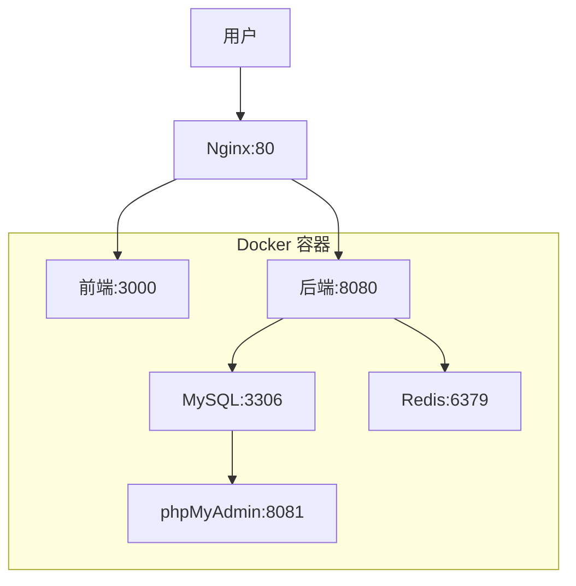

# AI Cockpit 部署指南

> 基于 Docker Compose 的一键部署方案

## 🚀 快速开始

### 环境要求

- **操作系统**: Linux / macOS / Windows (WSL2)
- **Docker**: 20.10+ 
- **Docker Compose**: 2.0+
- **内存**: 最低 4GB，推荐 8GB+
- **磁盘空间**: 最低 10GB

### 一键部署

```bash
# 克隆项目
git clone https://github.com/your-org/ai-cockpit.git
cd ai-cockpit

# 一键部署
./scripts/deploy.sh start
```

### 访问地址

部署完成后，可以通过以下地址访问：

- **前端界面**: http://localhost:3000
- **后端API**: http://localhost:8080
- **API文档**: http://localhost:8080/swagger-ui.html
- **数据库管理**: http://localhost:8081 (phpMyAdmin)

## 📋 部署架构



## 🔧 详细部署步骤

### 1. 环境准备

确保系统已安装 Docker 和 Docker Compose：

```bash
# 检查 Docker 版本
docker --version

# 检查 Docker Compose 版本
docker-compose --version
```

### 2. 配置文件调整

根据实际环境修改配置文件：

```bash
# 复制环境配置文件
cp .env.example .env

# 编辑配置文件
vim .env
```

主要配置项：

```env
# 数据库配置
MYSQL_ROOT_PASSWORD=root
MYSQL_DATABASE=ai_cockpit
MYSQL_USER=ai_user
MYSQL_PASSWORD=ai_password

# Redis配置
REDIS_PASSWORD=

# 后端服务配置
SERVER_PORT=8080
JWT_SECRET=your-jwt-secret-key

# 前端服务配置
VITE_API_BASE_URL=http://localhost:8080/api/v1
```

### 3. 构建和启动服务

```bash
# 构建镜像
docker-compose build

# 启动所有服务
docker-compose up -d

# 查看服务状态
docker-compose ps
```

### 4. 数据库初始化

```bash
# 等待数据库启动
sleep 30

# 执行数据库初始化脚本
docker-compose exec mysql mysql -u root -p$MYSQL_ROOT_PASSWORD $MYSQL_DATABASE < scripts/init-database.sql
```

### 5. 验证部署

```bash
# 检查服务日志
docker-compose logs backend
docker-compose logs frontend

# 检查服务健康状态
curl http://localhost:8080/actuator/health
curl http://localhost:3000
```

## 🐳 Docker 配置说明

### docker-compose.yml

```yaml
version: '3.8'
services:
  # MySQL 数据库
  mysql:
    image: mysql:8.0
    container_name: ai-cockpit-mysql
    environment:
      MYSQL_ROOT_PASSWORD: ${MYSQL_ROOT_PASSWORD}
      MYSQL_DATABASE: ${MYSQL_DATABASE}
      MYSQL_USER: ${MYSQL_USER}
      MYSQL_PASSWORD: ${MYSQL_PASSWORD}
    volumes:
      - mysql_data:/var/lib/mysql
      - ./scripts/init-database.sql:/docker-entrypoint-initdb.d/init.sql
    ports:
      - "3306:3306"
    networks:
      - ai-cockpit-network

  # Redis 缓存
  redis:
    image: redis:7-alpine
    container_name: ai-cockpit-redis
    command: redis-server --appendonly yes
    volumes:
      - redis_data:/data
    ports:
      - "6379:6379"
    networks:
      - ai-cockpit-network

  # 后端服务
  backend:
    build:
      context: ./ai-cockpit-backend
      dockerfile: Dockerfile
    container_name: ai-cockpit-backend
    environment:
      SPRING_PROFILES_ACTIVE: docker
      SPRING_DATASOURCE_URL: jdbc:mysql://mysql:3306/${MYSQL_DATABASE}
      SPRING_DATASOURCE_USERNAME: ${MYSQL_USER}
      SPRING_DATASOURCE_PASSWORD: ${MYSQL_PASSWORD}
      SPRING_REDIS_HOST: redis
      SPRING_REDIS_PORT: 6379
    ports:
      - "8080:8080"
    depends_on:
      - mysql
      - redis
    networks:
      - ai-cockpit-network

  # 前端服务
  frontend:
    build:
      context: ./ai-cockpit-frontend
      dockerfile: Dockerfile
    container_name: ai-cockpit-frontend
    ports:
      - "3000:80"
    depends_on:
      - backend
    networks:
      - ai-cockpit-network

  # Nginx 反向代理（可选）
  nginx:
    image: nginx:alpine
    container_name: ai-cockpit-nginx
    volumes:
      - ./nginx.conf:/etc/nginx/nginx.conf
    ports:
      - "80:80"
    depends_on:
      - frontend
      - backend
    networks:
      - ai-cockpit-network

  # 数据库管理工具（可选）
  phpmyadmin:
    image: phpmyadmin/phpmyadmin
    container_name: ai-cockpit-phpmyadmin
    environment:
      PMA_HOST: mysql
      PMA_PORT: 3306
      MYSQL_ROOT_PASSWORD: ${MYSQL_ROOT_PASSWORD}
    ports:
      - "8081:80"
    depends_on:
      - mysql
    networks:
      - ai-cockpit-network

volumes:
  mysql_data:
  redis_data:

networks:
  ai-cockpit-network:
    driver: bridge
```

### 后端 Dockerfile

```dockerfile
# 构建阶段
FROM maven:3.8.6-openjdk-17 AS build
WORKDIR /app
COPY pom.xml .
COPY src ./src
RUN mvn clean package -DskipTests

# 运行阶段
FROM openjdk:17-jdk-slim
WORKDIR /app
COPY --from=build /app/target/*.jar app.jar

# 创建非root用户
RUN groupadd -r spring && useradd -r -g spring spring
USER spring

# 健康检查
HEALTHCHECK --interval=30s --timeout=3s --start-period=5s --retries=3 \
    CMD curl -f http://localhost:8080/actuator/health || exit 1

# JVM参数
ENV JAVA_OPTS="-Xms512m -Xmx1024m -XX:+UseG1GC"

EXPOSE 8080
ENTRYPOINT ["sh", "-c", "java $JAVA_OPTS -jar app.jar"]
```

### 前端 Dockerfile

```dockerfile
# 构建阶段
FROM node:18-alpine AS build
WORKDIR /app
COPY package*.json ./
RUN npm ci --only=production
COPY . .
RUN npm run build

# 运行阶段
FROM nginx:alpine
COPY --from=build /app/dist /usr/share/nginx/html
COPY nginx.conf /etc/nginx/nginx.conf

# 健康检查
HEALTHCHECK --interval=30s --timeout=3s --start-period=5s --retries=3 \
    CMD wget --no-verbose --tries=1 --spider http://localhost:80 || exit 1

EXPOSE 80
```

## ⚙️ 配置管理

### 环境变量配置

创建 `.env` 文件：

```env
# 应用配置
APP_NAME=AI Cockpit
APP_VERSION=1.0.0
APP_ENV=production

# 数据库配置
MYSQL_ROOT_PASSWORD=root
MYSQL_DATABASE=ai_cockpit
MYSQL_USER=ai_user
MYSQL_PASSWORD=ai_password
MYSQL_HOST=mysql
MYSQL_PORT=3306

# Redis配置
REDIS_HOST=redis
REDIS_PORT=6379
REDIS_PASSWORD=

# JWT配置
JWT_SECRET=your-super-secret-jwt-key-change-in-production
JWT_EXPIRATION=86400

# 文件上传配置
FILE_UPLOAD_DIR=/app/uploads
FILE_MAX_SIZE=10485760

# 邮件配置（可选）
SMTP_HOST=smtp.gmail.com
SMTP_PORT=587
SMTP_USERNAME=your-email@gmail.com
SMTP_PASSWORD=your-app-password

# 监控配置
PROMETHEUS_ENABLED=true
METRICS_ENABLED=true
```

### Nginx 配置

创建 `nginx.conf`：

```nginx
events {
    worker_connections 1024;
}

http {
    include /etc/nginx/mime.types;
    default_type application/octet-stream;

    # 上游服务
    upstream backend {
        server backend:8080;
    }

    upstream frontend {
        server frontend:80;
    }

    # 日志格式
    log_format main '$remote_addr - $remote_user [$time_local] "$request" '
                    '$status $body_bytes_sent "$http_referer" '
                    '"$http_user_agent" "$http_x_forwarded_for"';

    access_log /var/log/nginx/access.log main;
    error_log /var/log/nginx/error.log;

    # Gzip压缩
    gzip on;
    gzip_types text/plain text/css application/json application/javascript text/xml application/xml application/xml+rss text/javascript;

    server {
        listen 80;
        server_name localhost;

        # 前端静态资源
        location / {
            proxy_pass http://frontend;
            proxy_set_header Host $host;
            proxy_set_header X-Real-IP $remote_addr;
            proxy_set_header X-Forwarded-For $proxy_add_x_forwarded_for;
            proxy_set_header X-Forwarded-Proto $scheme;
        }

        # API代理
        location /api/ {
            proxy_pass http://backend;
            proxy_set_header Host $host;
            proxy_set_header X-Real-IP $remote_addr;
            proxy_set_header X-Forwarded-For $proxy_add_x_forwarded_for;
            proxy_set_header X-Forwarded-Proto $scheme;
            
            # 超时设置
            proxy_connect_timeout 30s;
            proxy_send_timeout 30s;
            proxy_read_timeout 30s;
        }

        # 静态资源缓存
        location ~* \.(js|css|png|jpg|jpeg|gif|ico|svg)$ {
            expires 1y;
            add_header Cache-Control "public, immutable";
            proxy_pass http://frontend;
        }

        # 健康检查
        location /health {
            access_log off;
            return 200 "healthy\n";
            add_header Content-Type text/plain;
        }
    }
}
```

## 🔄 运维管理

### 服务管理命令

```bash
# 启动服务
docker-compose up -d

# 停止服务
docker-compose down

# 重启服务
docker-compose restart

# 查看服务状态
docker-compose ps

# 查看服务日志
docker-compose logs -f backend
docker-compose logs -f frontend

# 进入容器
docker-compose exec backend bash
docker-compose exec mysql mysql -u root -p
```

### 数据备份和恢复

```bash
# 备份数据库
docker-compose exec mysql mysqldump -u root -p$MYSQL_ROOT_PASSWORD $MYSQL_DATABASE > backup.sql

# 恢复数据库
docker-compose exec -T mysql mysql -u root -p$MYSQL_ROOT_PASSWORD $MYSQL_DATABASE < backup.sql

# 备份Redis数据
docker-compose exec redis redis-cli save
sudo cp -r /var/lib/docker/volumes/ai-cockpit_redis_data ./redis-backup
```

### 监控和日志

```bash
# 查看容器资源使用
docker stats

# 查看系统日志
journalctl -u docker.service

# 设置日志轮转
sudo vim /etc/logrotate.d/docker
```

## 🔒 安全配置

### 生产环境安全建议

1. **修改默认密码**:
   ```env
   MYSQL_ROOT_PASSWORD=strong-password-here
   JWT_SECRET=very-long-random-secret-key
   ```

2. **启用HTTPS**:
   ```nginx
   server {
       listen 443 ssl;
       ssl_certificate /path/to/cert.pem;
       ssl_certificate_key /path/to/key.pem;
       # ...其他配置
   }
   ```

3. **防火墙配置**:
   ```bash
   # 只开放必要端口
   ufw allow 80/tcp
   ufw allow 443/tcp
   ufw enable
   ```

4. **定期更新**:
   ```bash
   # 更新镜像
docker-compose pull
docker-compose up -d
   ```

## 🚨 故障排除

### 常见问题

**问题1**: 数据库连接失败
```bash
# 检查数据库状态
docker-compose logs mysql

# 检查网络连接
docker network inspect ai-cockpit_ai-cockpit-network
```

**问题2**: 前端无法访问后端API
```bash
# 检查后端服务状态
curl http://localhost:8080/actuator/health

# 检查网络配置
docker-compose exec frontend ping backend
```

**问题3**: 内存不足
```bash
# 调整JVM参数
environment:
  JAVA_OPTS: "-Xms256m -Xmx512m"
```

**问题4**: 端口冲突
```bash
# 修改端口映射
ports:
  - "8081:8080"  # 后端服务
  - "3001:80"    # 前端服务
```

### 日志分析

```bash
# 查看所有服务日志
docker-compose logs --tail=100

# 查看特定服务错误日志
docker-compose logs backend | grep ERROR

# 实时监控日志
docker-compose logs -f
```

## 📈 性能优化

### 数据库优化

```sql
-- 添加索引
CREATE INDEX idx_users_status ON users(status);
CREATE INDEX idx_models_type ON models(model_type);

-- 优化查询
EXPLAIN SELECT * FROM users WHERE status = 1;
```

### JVM 优化

```env
# 调整JVM参数
JAVA_OPTS="-Xms1g -Xmx2g -XX:+UseG1GC -XX:MaxGCPauseMillis=200"
```

### Nginx 优化

```nginx
# 调整工作进程数
worker_processes auto;

# 调整连接数
worker_connections 4096;

# 启用缓存
proxy_cache_path /var/cache/nginx levels=1:2 keys_zone=my_cache:10m;
```

## 🔄 版本升级

### 升级流程

1. **备份数据**:
   ```bash
   ./scripts/backup.sh
   ```

2. **停止服务**:
   ```bash
   docker-compose down
   ```

3. **更新代码**:
   ```bash
   git pull origin main
   ```

4. **重建镜像**:
   ```bash
   docker-compose build --no-cache
   ```

5. **启动服务**:
   ```bash
   docker-compose up -d
   ```

6. **验证升级**:
   ```bash
   ./scripts/health-check.sh
   ```

## 📞 技术支持

如果遇到问题，请：

1. 查看日志文件：`docker-compose logs`
2. 检查服务状态：`docker-compose ps`
3. 查看文档：[项目文档](README.md)
4. 提交Issue：[GitHub Issues](https://github.com/your-org/ai-cockpit/issues)

### 联系方式

- **邮箱**: devops@ai-cockpit.com
- **文档**: https://docs.ai-cockpit.com
- **社区**: https://community.ai-cockpit.com

## 📝 变更记录

| 版本 | 日期 | 变更说明 |
|------|------|----------|
| v1.0.0 | 2024-01-01 | 初始版本发布 |
| v1.1.0 | 2024-02-01 | 增加监控功能 |
| v1.2.0 | 2024-03-01 | 优化性能配置 |

---

**注意**: 本部署指南会随着项目更新而不断完善，请定期查看最新版本。